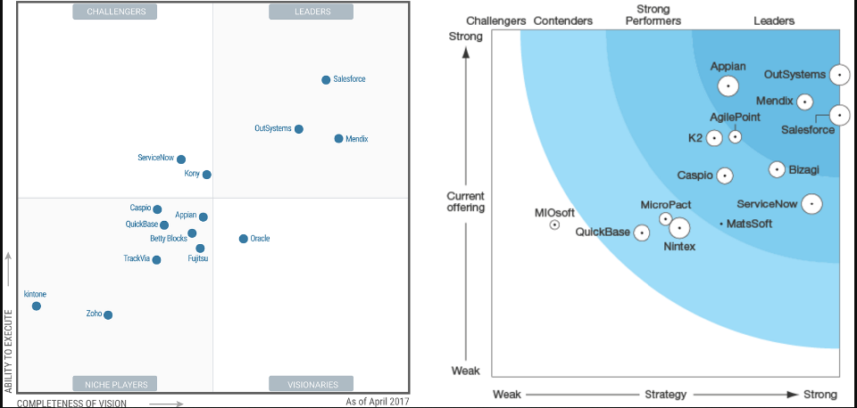

# 关于 Low-Code Platform

软件研发领域一直有一种思潮，希望能开发出一种能“构建应用软件”的软件系统 —— 人们不需要掌握艰深的编程语言、不需要拥有丰富的开发经验，通过图形化的界面和直观的操作就可以在这个系统中构造出应用软件。

二、三十年来技术界一直在做努力，提出了诸如 Model Driven Development（模型驱动开发）等思想和方法，结合不断演进的客户端、服务端基础开发技术，达到了一定的成果。

这是 Gartner and Forrester 发布的这个领域的厂商/产品四象限分布图，可以看到当前领先的有 OutSystems、Mendix 等。

相关产品链接如下：

https://www.outsystems.com/low-code-platforms/

https://www.mendix.com/application-platform-as-a-service/

以往 low-code 产品方向主要朝向如何构建本地运行的应用系统，而最近几年方向更加倾向于建立 application-platform-as-a-service 服务。也即所构建的业务应用是运行在 low-code 提供商所运营的云平台上的，比较有名和典型的就是 Salesforce.com 了。

这里有一些参考资料：

https://www.outsystems.com/blog/what-is-low-code.html

这里有文章提到 low-code 软件系统适合构建哪些类型的应用软件：

https://www.mendix.com/blog/can-build-low-code-platform/

总结大概有几种：

- 创新型应用：从某一个业务创意快速构建系统，这类系统主体目标明确、不需要顾虑太多复杂关联。
- 订制型应用：业务清晰明确，但开发团队并非业务专家，通过业务建模和图形化快速开发能增进达成开发团队和业务用户对最终成果的一致性。
- 效率型应用：从人工、纸质业务流提升到自动化、信息化业务流，来提升工作效能，如客服系统、供应链系统、订单管理系统。
- 传统替代型应用：把原来基于 Excel、SharePoint、Access 等通用工具的业务迁移到专业化的业务系统。

这里还有一些分析评价：

https://blog.csdn.net/xcjing/article/details/78883826

https://searchcloudapplications.techtarget.com/tip/Mitigate-low-code-no-code-platform-security-risks

总体而言 low-code 方向自去年以来又开始提升热度，近年来在技术角度也确有许多提升和改进。创造能“构建系统”的系统是技术社区追求的方向之一，但应该还有许多的路要走。
