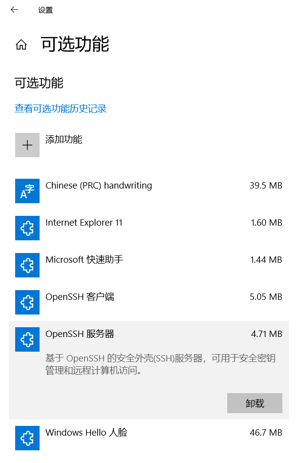
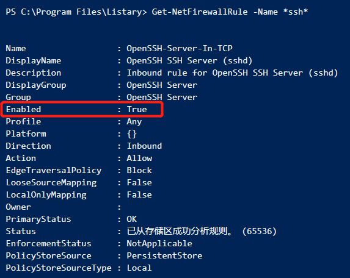
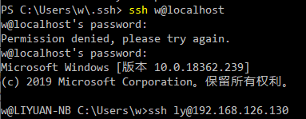

# 使用中转机从互联网访问内网服务器

## 概述

在许多项目中，业务系统部署与内网服务器，这些服务器不能直接与互联网联通（包括不能用VPN从互联网直接连入内网）。

有时我们需要通过互联网（`远控机`）远程接入到 `内网服务器` 上进行运维操作，这时可以利用一台 `中转机` ，这台 `中转机` 既能访问互联网同时也能访问内网，运维工程师可以通过互联网 `远控机` 连入这台 `中转机`，然后通过控制 `中转机` 来对 `内网服务器` 进行操作。

有许多方法可以达成这一点，其中一类是通过远程桌面控制软件来控制中转机，进而操作内网服务器。包括：

- QQ 远程桌面
- TeamViewer：https://www.teamviewer.com/
- AnyDesk：https://www.anydesk.com/
- 向日葵：https://sunlogin.oray.com/personal/

远程桌面类方法很直观方便，但因为要传输 `中转机` 的 GUI 画面，数据传输量比较大，在网络质量较差时响应速度不理想，比如在文件管理器 GUI 界面中切换一次目录可能都需要十几秒甚至更长时间才能看到画面更新的结果。

如果我们能够通过 `中转机` 仅传递相关操作命令的输入、输出内容（大多时候是文本信息），就能极大减小数据传输量，在网络质量较差时仍然能够流畅的控制内网服务器。

在比较规范的团队或环境中，`中转机` 很多时候是由 **堡垒机** 来担当的。堡垒机（如 `Jumpserver`，http://www.jumpserver.org/ ）不但能完成内外网的访问中转，也能对访问进行审计和诸多控制，还支持多种不同协议，是比较强大的。堡垒机的部署在网络上有许多介绍，这里就不赘述了。

在我们遇到的需要临时访问内网服务器的场景中，大多时候是用技术人员的笔记本电脑作为 `中转机`，这台 `中转机` 一般安装了 Windows 10 操作系统，通过网线接入内网，并且通过无线 WIFI 连接了互联网。

## 思路

这里介绍的方法是利用 SSH 技术（主要使用 OpenSSH 软件）来达成目标。

因为搭建环境的关键是 `中转机` 所以我们主要描述中转机上的部署、配置和使用。我们假定 `远控机` 和 `内网服务器` 都已分别安装好 SSH 客户端软件和 SSH 服务。

大致有两种方案：

- 远控机(互联网) -> WIFI 端口映射 -> 中转机(内外网) -> 服务器(内网)
- 远控机(互联网) -> 公共转发服务(互联网，如 serveo.net) <- 中转机(内外网) -> 服务器(内网)

## 中转机的 OpenSSH 安装和设置

### 安装

Windows 10 (1803) 及以上版本中内置了 OpenSSH Server 和 Client。可以通过 “设置” -> “应用和功能” -> “可选功能” -> “添加功能” 来进行安装。安装后的效果如下图：



安装路径默认为 `C:\Windows\System32\OpenSSH\`，其中包含有：

|            程序 | 说明                                                                                        |
| --------------: | :------------------------------------------------------------------------------------------ |
|        sshd.exe | which is the SSH server component that must be running on the system being managed remotely |
|         ssh.exe | which is the SSH client component that runs on the user's local system                      |
|  ssh-keygen.exe | generates, manages and converts authentication keys for SSH                                 |
|   ssh-agent.exe | stores private keys used for public key authentication                                      |
|     ssh-add.exe | adds private keys to the list allowed by the server                                         |
| ssh-keyscan.exe | aids in collecting the public SSH host keys from a number of hosts                          |
|        sftp.exe | is the service that provides the Secure File Transfer Protocol, and runs over SSH           |
|         scp.exe | is a file copy utility that runs on SSH                                                     |

可以参考微软官网文档了解更多信息：https://docs.microsoft.com/en-us/windows-server/administration/openssh/openssh_install_firstuse

> 除了使用 Win10 内置的 OpenSSH 以外，还可以在其官网 https://www.openssh.com/ 下载安装，对此本文就不作介绍了。

### OpenSSH Server 初始设置

Win10 内置的 OpenSSH Server 安装好后还需要进行初始设置。设置 OpenSSH Server 需要用管理员权限运行下列 PowerShell 脚本。

```powershell
# 启动 OpenSSH Server 服务
Start-Service sshd
# 设置 OpenSSH Server 服务为随系统自动启动（可选）
Set-Service -Name sshd -StartupType 'Automatic'
# OpenSSH Server 的安装过程中会自动创建防火墙规则 "OpenSSH-Server-In-TCP"，这里确认一下此规则已被正确配置
Get-NetFirewallRule -Name *ssh*
```

正确配置了防火墙规则后，PowerShell 应该显示如下：



> **Win10 内置的 OpenSSH Server 密钥文件安全性问题**
>
> 在 Win10 内置的 OpenSSH 早期版本中（至少早于2019年1月时），安装时自动生成的 OpenSSH Server 的密钥文件未能得到正确的权限设置，存在一定的安全隐患，官网文档（2018/09/27）建议用一个临时 PowerShell 脚本做处理 `OpenSSHUtils`。**这个脚本本身也存在一些问题，我们不建议使用。**
>
> 手动修复此问题的指引应该参见这篇文章：
https://github.com/PowerShell/Win32-OpenSSH/wiki/Security-protection-of-various-files-in-Win32-OpenSSH
>
> 在 Windows 10 (1903) 及后续版本中，上述文件权限问题已经被修复了，通过 `应用和功能` 安装完毕后相应的密钥文件权限已经得到了正确的设置，不必作额外操作。

### OpenSSH Client

Win10 内置的 OpenSSH Client 不需要额外配置就可以直接使用。

### 简单使用

现在可以通过本机的 OpenSSH Client 访问本机 OpenSSH Server 来简单验证一下功能是否正常。

```shell
# 本机命令行操作, 其中 w 是 Windows 系统本地账户。
# 第一次连接会提示是否确认连接此服务器
ssh w@localhost
```

输入正确密码后应该能正常连接，类似下面图示：



注意，连接 Win10 内置的 OpenSSH Server 后，得到的是 Windows CMD 环境，只能运行 `dir` 等内置命令以及 `PATH` 环境变量涵盖的路径下的程序。

幸运的是，再前面的安装过程中，OpenSSH 程序路径已经自动设置到 `PATH` 中了，所以我们可以继续利用 SSH 访问内网机器。

```shell
# 查看 PATH 环境变量
path
# 在已有的 SSH 会话中连接新的 SSH 服务器
ssh ly@192.168.126.130
```

### 管理 OpenSSH 的密钥

Windows 系统主要采用 `用户名-密码` 来进行用户认证，这在公共 Windows 域中会比较方便，但如果存在跨域的情况用起来可能就会比较复杂。

所以我们推荐使用类似 Linux 的 `公钥-私钥` 来完成 SSH 认证。

#### 客户端密钥处理

我们需要用到下列工具：

- ssh-keygen for generating secure keys
- ssh-agent and ssh-add for securely storing private keys
- scp and sftp to securely copy public key files during initial use of a server

以上内容还可以参考微软官方文档：https://docs.microsoft.com/en-us/windows-server/administration/openssh/openssh_keymanagement

- 启用 ssh-agent
- 生成本机密钥对
- 添加私钥到可信存储
- 上传公钥到服务器

[待完善]
