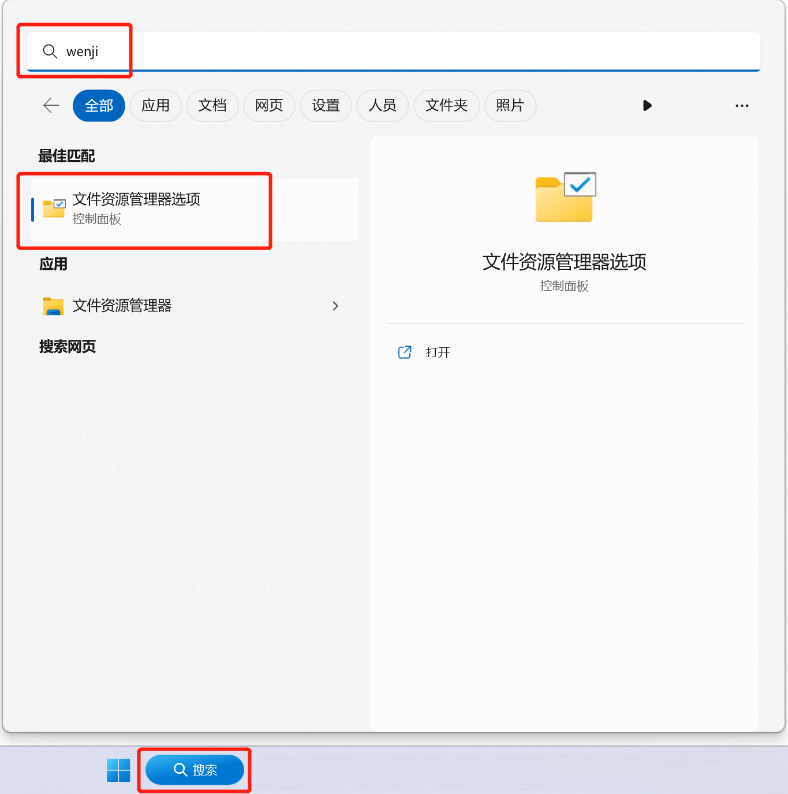
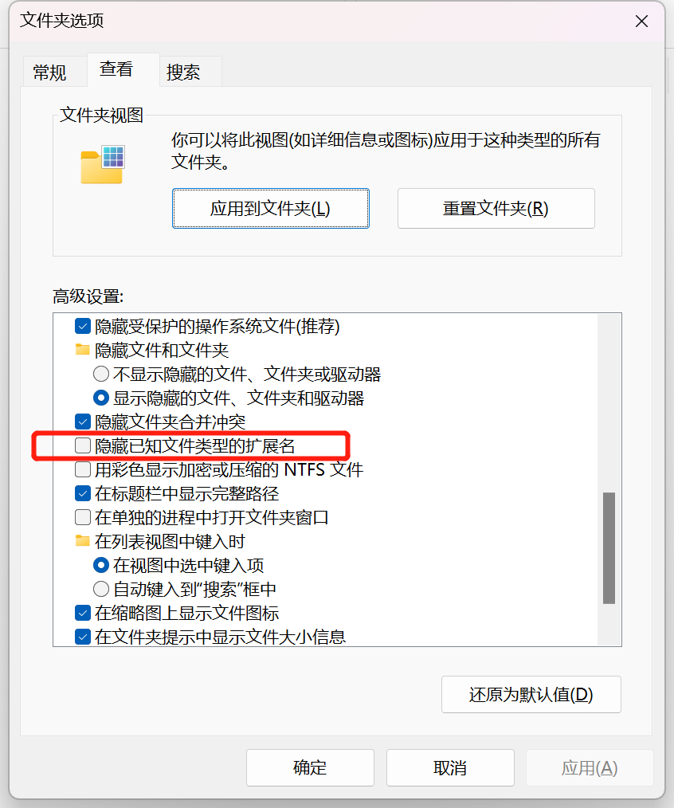
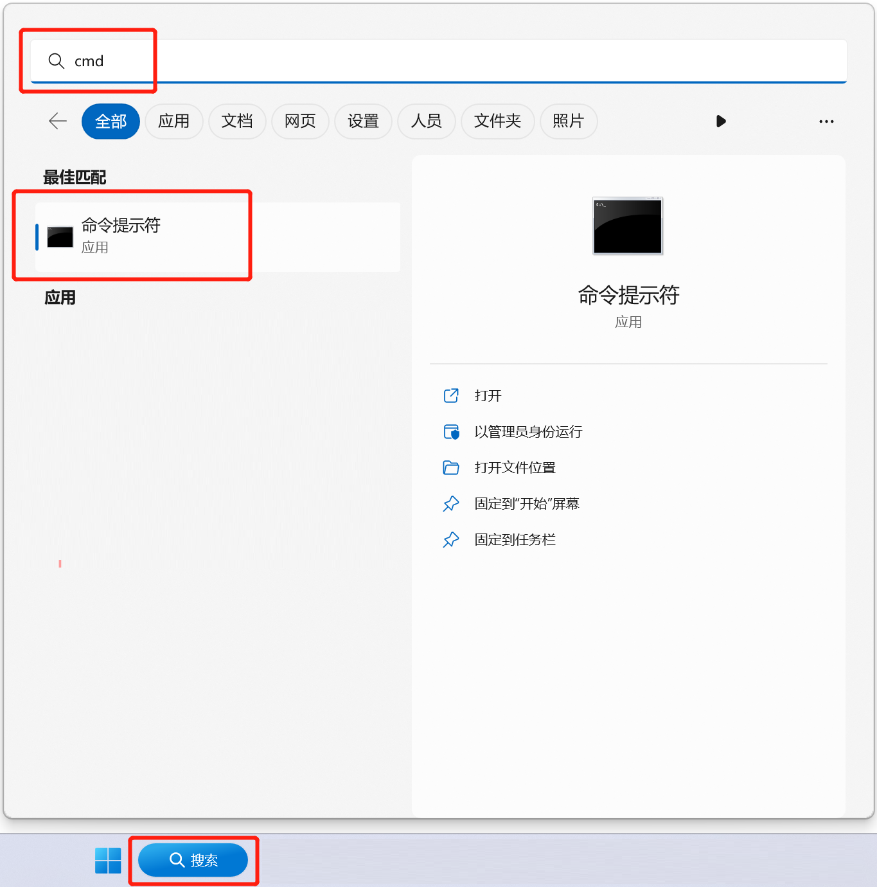
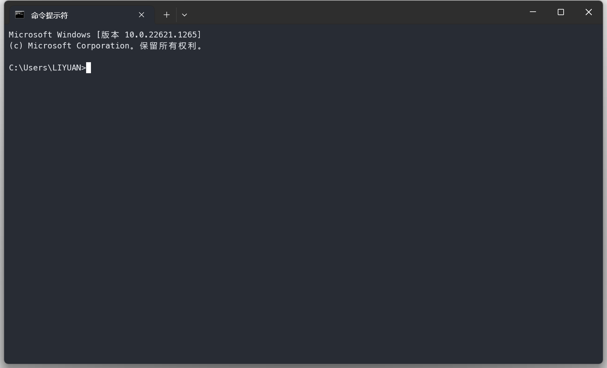
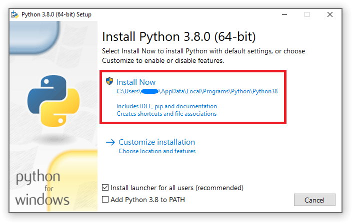
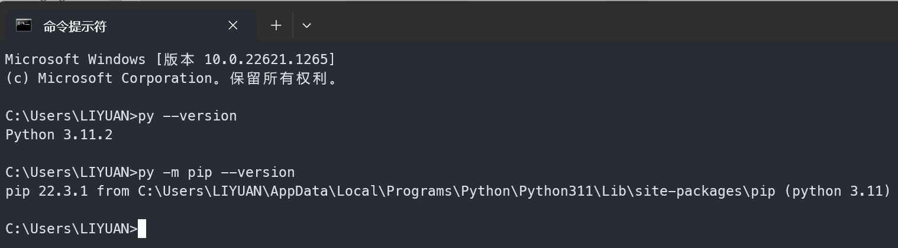
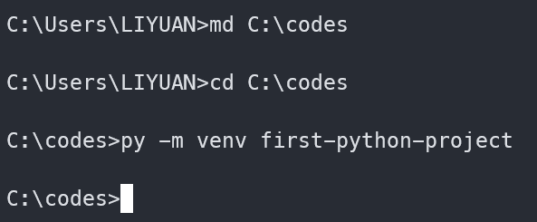
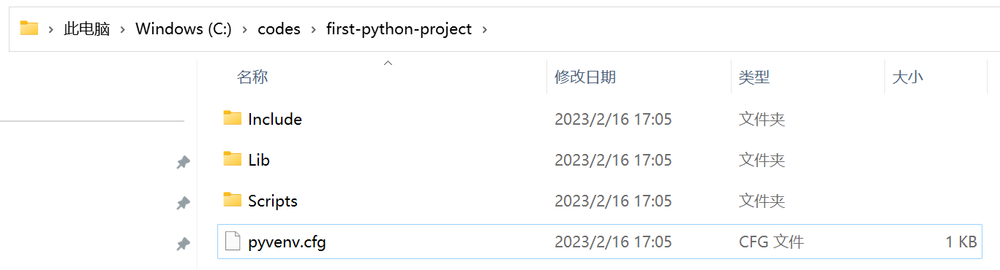
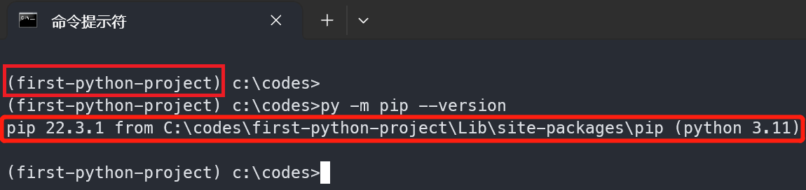
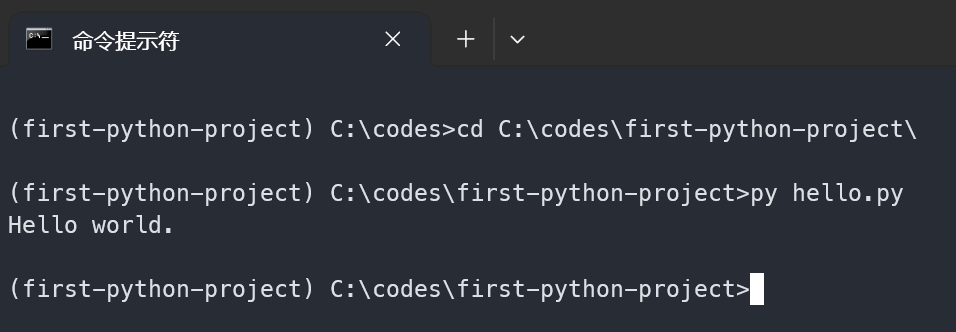

# 面向非计算机专业研究者的 Python 使用指南

大多数非计算机专业的同学可能都是使用 Windows 操作系统，本指南也以此系统上的操作为准。

## 需要改变的一点小习惯

修改 Windows 系统选项。



不要勾选隐藏扩展名选项。



喜欢双击文件运行程序的同学需要注意：

做 Python 开发过程中经常需要执行 Python 源代码程序（`*.py`），双击文件运行固然方便，但不能灵活的调整运行参数，所以需要改变习惯，使用 Windows 的 “命令提示符” 来运行。



点击运行后会出现黑窗口，在其中输入想执行的命令字符，敲回车键就可以运行了。下文中需要进行相关操作的时候会说明。



> 运行“命令提示符”后的黑窗口也常常被称作“终端”或“控制台”。

参考文章：

- [Windows命令行简易入门](https://blog.csdn.net/zhrb/article/details/119192010)
- [百度百科](https://baike.baidu.com/item/%E5%91%BD%E4%BB%A4%E6%8F%90%E7%A4%BA%E7%AC%A6/998728)

## 安装 Python

> 新项目建议选择 3.8 版以上的较新版本，因为更低的版本维护期不足一年或已不再维护了。

安装包下载地址如下：

- Python 官网下载安装包：https://www.python.org/downloads/
- 国内淘宝镜像站下载安装包：https://registry.npmmirror.com/binary.html?path=python/

注意 64 位 Windows 系统应选择 `amd64` 架构的安装包，例如 `python-3.11.2-amd64.exe`：

- https://www.python.org/ftp/python/3.11.2/python-3.11.2-amd64.exe
- https://registry.npmmirror.com/-/binary/python/3.11.2/python-3.11.2-amd64.exe

运行安装程序后，选择默认选项进行安装就可以了，如图。

)

接下来快速测试一下是否已安装成功。

在“命令提示符”窗口中输入下述命令，应该得到相关信息输出。

```cmd
py --version
py -m pip --version
```

结果应该类似下图。



接下来为要开发的项目选择一个代码目录，并在此目录中初始化运行环境。

例如把代码目录创建在 `C:\codes\first-python-project\` 这里。

依次在“命令提示符”窗口中输入下述命令：

```cmd
md C:\codes
cd C:\codes
py -m venv first-python-project
```



此时在 Windows 中打开目录 `C:\codes\first-python-project\`， 会看到里边多了很多子目录和文件。



用下述命令激活初始化好的环境。

```cmd
first-python-project\Scripts\activate
py -m pip --version
```



可以把上面图片与前面检查安装时的命令输出相比较，可以看到输出信息中标红的部分已经变为新目录了，说明此时是在使用基于 `first-python-project` 的项目环境了。

（可选）有时国内访问 Python 官方包仓库很慢，可以通过配置使用国内镜像来加速。

在 `C:\Users\<用户>` 目录下创建名为 `pip.ini` 的文本文件。其中 `<用户>` 要用实际的 Windows 用户名替换，比如替换后我的目录就是 `C:\Users\LIYUAN`。

编辑 `pip.ini` 文件，把下面的配置信息复制粘贴进去。

```ini
[global]
index-url = https://mirrors.aliyun.com/pypi/simple/

[install]
trusted-host=mirrors.aliyun.com
```

至此 Python 运行环境就做好了。

参考资料：

- https://packaging.python.org/en/latest/tutorials/installing-packages/
- 

## 编写和运行第一个 Python 程序

在 `C:\codes\first-python-project\` 目录中创建 Python 代码 `hello.py`，并写下简单的程序代码，如下：

```py
print("Hello world.")
```

在 __激活后__ 的“命令提示符”窗口中运行 `hello.py` 程序。

```cmd
cd C:\codes\first-python-project
py hello.py
```

可以得到正确运行后的输出提示，如：



## 安装开发工具

安装 VSCode 和 Python 开发插件。

```cmd
py -m pip install -U black
```

## 
