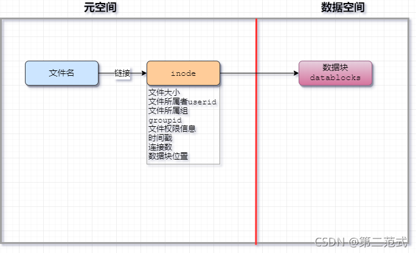
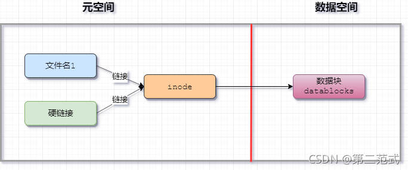
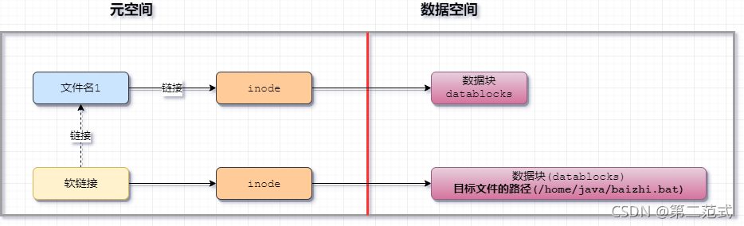

# Linux 运维操作基础

本文整理日常 Linux 操作中常用的基础命令，适合作为入门和速查材料。不同发行版、桌面环境和服务管理器的行为可能存在差异，执行影响系统运行或数据安全的命令前，应先确认目标环境和命令含义。

> 安全提示：
>
> - Linux 命令区分大小写。
> - `rm`、`dd`、`mkfs`、`fdisk`、`shutdown`、`reboot`、防火墙规则等命令可能删除数据、中断服务或影响网络连通性；执行前必须确认目标路径、磁盘设备和执行窗口，并准备好回滚方案。
> - 对不确定的删除操作，优先先使用 `ls` 列出目标内容，或使用命令提供的 `--dry-run` 选项预览行为。

## 查看系统信息

```sh
# 发行版信息
cat /etc/os-release

# 内核和架构
uname -a

# 主机名
hostname
hostnamectl status

# 磁盘空间
df -h

# 内存和交换分区
free -h

# CPU 信息
lscpu
```

## 控制台和基本命令

### 关机、重启和注销

```sh
# 立即关机
sudo shutdown now

# 重启
sudo reboot

# 取消已计划的关机或重启
sudo shutdown -c
```

远程服务器重启前，应确认业务流量、集群状态和存储挂载状态，并预留下次登录的带外管理或控制台入口。

### 查看系统时间

```sh
date
timedatectl
```

### 查看帮助

```sh
# shell 内置命令或外部命令的简短说明
ls --help

# 手册
man ls

# 在手册中搜索关键字
/keyword
```

退出 `man` 时按 `q`。

## Linux 文件系统

Linux 采用单一的树形目录结构，根目录是 `/`。日常操作中，“一切皆文件”的含义是设备、进程状态、系统配置等资源也经常通过文件路径暴露。


| Linux 目录       | 常见用途                                                         | Windows 对比                          |
| ---------------- | ---------------------------------------------------------------- | ------------------------------------- |
| `/boot`          | 系统启动文件                                                     | 引导分区相关文件                      |
| `/etc`           | 系统和软件配置文件                                               | 类似注册表和服务配置                  |
| `/home`          | 普通用户主目录                                                   | `C:\Users\<用户名>`                   |
| `/root`          | root 用户主目录                                                  | `C:\Users\Administrator`              |
| `/tmp`           | 临时文件，部分系统会定期清理                                     | 临时目录                              |
| `/var`           | 日志、缓存、可变数据                                             | 程序数据和日志目录                    |
| `/opt`           | 额外安装的独立软件                                               | `C:\Program Files`                    |
| `/mnt`           | 常用临时挂载点                                                   | 光盘或 U 盘盘符                       |
| `/proc`          | 内核和进程运行状态                                               | 任务管理器的底层信息                  |
| `/dev`           | 设备文件                                                         | 设备管理器中的设备                    |
| `/usr`           | 用户命令、库文件和应用资源                                       | `C:\Program Files` 和系统组件         |
| `/lost+found`    | 文件系统修复后恢复的孤立文件，具体是否存在与文件系统类型有关     | 磁盘检查结果目录                      |

## 目录操作

```sh
# 切换目录
cd /etc
cd ..
cd ~

# 查看当前目录
pwd

# 查看目录内容
ls
ls -l
ls -la

# 创建目录
mkdir project
mkdir -p docs/images

# 重命名或移动目录
mv old-dir new-dir

# 复制目录
cp -a source-dir target-dir

# 删除空目录
rmdir empty-dir

# 删除非空目录；执行前必须确认路径
rm -rf target-dir
```

## 文件操作

```sh
# 创建空文件或更新修改时间
touch note.txt

# 复制文件
cp source.txt target.txt

# 移动或重命名
mv old.txt new.txt

# 删除文件
rm note.txt

# 查看文件类型
file note.txt

# 查看文件大小
ls -lh note.txt
du -h note.txt
```

### 文件链接

Linux 文件系统中的文件名与文件数据通过 inode 关联。硬链接是同一个 inode 的多个文件名；软链接则是保存目标路径的特殊文件。



#### 硬链接

```sh
ln source-file hard-link-file
```

硬链接特点：

- 多个硬链接具有相同 inode。
- 删除其中一个文件名不会立即删除数据，只有所有硬链接被删除后，数据空间才可能释放。
- 不能跨文件系统创建，通常不能针对目录创建。



#### 软链接

```sh
ln -s target-file soft-link-file
```

软链接特点：

- 保存目标路径，可以跨文件系统。
- 目标文件被删除或移动后，软链接可能失效。
- 修改软链接内容时，实际修改的是目标文件。



## 查找文件和目录

```sh
# 按名称查找
find . -name "*.log"

# 按类型查找
find /var/log -type f -name "*.gz"

# 按大小查找
find . -type f -size +100M

# 查找目录
find . -type d -name build
```

如果系统安装了 `locate`，可以先更新数据库再查找：

```sh
sudo updatedb
locate nginx.conf
```

## 文件内容操作

### 查看文件

```sh
cat file.txt
more file.txt
less file.txt
head -n 20 file.txt
tail -n 20 file.txt

# 持续查看日志新增内容
tail -f app.log
```

`less` 常用按键：

- `空格`：向下翻页
- `b`：向上翻页
- `/keyword`：搜索
- `q`：退出

### 写入和追加内容

```sh
# 覆盖写入
echo "hello" > file.txt

# 追加写入
echo "next line" >> file.txt

# 输出到屏幕并写入文件
echo "log" | tee -a app.log
```

### 编辑文件

常见编辑器：

```sh
vi file.txt
vim file.txt
nano file.txt
```

`vi` / `vim` 基本操作：

- `i`：进入插入模式
- `Esc`：回到普通模式
- `:w`：保存
- `:q`：退出
- `:wq`：保存并退出
- `:q!`：不保存退出

`nano` 更适合初学者，界面底部会提示常用快捷键。

## 压缩和解压缩

```sh
# 创建 tar 包
tar -cvf archive.tar directory/

# 创建 gzip 压缩包
tar -czvf archive.tar.gz directory/

# 解压 tar 包
tar -xvf archive.tar

# 解压 gzip 压缩包
tar -xzvf archive.tar.gz

# 解压 zip
unzip archive.zip
```

常用选项：

- `-c`：创建压缩包
- `-x`：解压
- `-v`：显示过程
- `-f`：指定文件名
- `-z`：使用 gzip
- `-C`：指定解压目标目录

## 用户、权限和 sudo

### 查看身份

```sh
whoami
id
groups
```

### 切换用户

```sh
# 切换到 root
sudo -i

# 以指定用户执行命令
sudo -u www-data command
```

日常运维不建议长期使用 root 会话。需要特权命令时优先使用 `sudo`，并保留审计记录。

### 查看和修改权限

```sh
# 查看权限
ls -l file.txt

# 修改属主和属组
sudo chown user:group file.txt

# 递归修改目录
sudo chown -R user:group directory/

# 修改权限
chmod 644 file.txt
chmod 755 script.sh
chmod +x script.sh
```

常见权限：

- `644`：属主可读写，组和其他用户只读，常用于普通配置文件。
- `600`：仅属主可读写，常用于私钥和敏感配置。
- `755`：属主可读写执行，组和其他用户可读执行，常用于目录和脚本。

## 网络管理

```sh
# 查看网卡和 IP
ip addr
ip link

# 查看路由
ip route

# 查看监听端口
ss -tulpn

# 测试网络连通
ping -c 4 example.com

# 查看DNS解析结果
getent hosts example.com
resolvectl query example.com

# 测试 HTTP 响应
curl -I https://example.com
```

不同发行版的网络配置方式差异较大。现代系统常用 NetworkManager、`netplan` 或 systemd-networkd，应先查看系统使用的网络管理器，再修改配置。

## 软件管理

Debian / Ubuntu：

```sh
sudo apt update
sudo apt install package
sudo apt remove package
sudo apt autoremove
apt search keyword
```

RHEL / CentOS / Fedora：

```sh
sudo dnf install package
sudo dnf remove package
dnf search keyword
```

不要在未确认来源的情况下安装软件。生产环境应使用受控仓库、内部镜像或经过校验的包。

## 进程和服务管理

```sh
# 查看进程
ps aux
ps -ef | grep nginx

# 动态查看资源
top
htop

# 结束进程；先尝试 TERM，再考虑 KILL
kill <pid>
kill -9 <pid>

# systemd 服务
systemctl status nginx
systemctl start nginx
systemctl stop nginx
systemctl restart nginx
systemctl enable nginx
systemctl disable nginx

# 查看服务日志
journalctl -u nginx -n 100
journalctl -u nginx -f
```

## 定时任务

查看和编辑当前用户 crontab：

```sh
crontab -l
crontab -e
```

示例：

```text
# 每天凌晨 2 点执行备份脚本
0 2 * * * /opt/scripts/backup.sh

# 每 10 分钟执行一次健康检查
*/10 * * * * /opt/scripts/check.sh
```

建议：

- 脚本使用绝对路径。
- 定时任务输出重定向到日志文件。
- 失败时增加告警或退出码检查。

## Shell 输入输出和管道

```sh
# 标准输出重定向
command > output.txt

# 追加输出
command >> output.txt

# 错误输出重定向
command 2> error.log

# 标准输出和错误输出写入同一文件
command > all.log 2>&1

# 管道
ps aux | grep nginx
cat access.log | grep " 500 " | wc -l
```

## Windows 中的 WSL

Windows Subsystem for Linux 可在 Windows 中运行 Linux 环境，适合开发和轻量学习：

```powershell
wsl --list --online
wsl --install -d Ubuntu
wsl --list --verbose
wsl --set-default Ubuntu
wsl --shutdown
```

WSL 不等同于生产服务器环境。涉及内核、存储、网络和系统服务的实践，仍应在目标 Linux 环境中验证。

## 参考资料

- [Linux man pages](https://man7.org/linux/man-pages/)
- [GNU Coreutils](https://www.gnu.org/software/coreutils/manual/)
- [systemd documentation](https://systemd.io/)

[^1]: 本文早期提纲参考了 [CSDN：第二范式](https://blog.csdn.net/weixin_44191814/article/details/120091363) 的整理思路，遵循 CC 4.0 BY-SA。

[^2]: 本文早期提纲参考了 [CSDN：Demon_gu](https://blog.csdn.net/qq_23329167/article/details/83856430) 的整理思路，遵循 CC 4.0 BY-SA。
