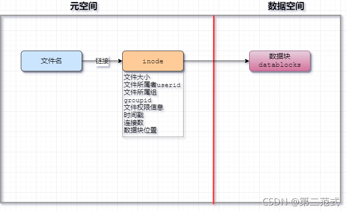

# Linux 运维操作基础 [^1] [^2]

> 注意事项：命令区分大小写

## 控制台和基本命令

### 关机、重启、注销

### 查看系统时间

### 帮助命令

## Linux 文件系统

- 在 Linux 世界里，一切皆文件。
- 只有一个顶级目录，不像windows分C盘、D盘、E盘


| Linux 目录        | 含义                                                                                                                       | Windows 对比                                                  |
| ----------------- | -------------------------------------------------------------------------------------------------------------------------- | ------------------------------------------------------------- |
| /boot             | linux系统启动的时候需要加载和使用的文件                                                                                    |
| /lib (/usr/lib)   | linux 系统所需要最基本的动态链接共享库，几乎所有的应用程序都需要用到这些共享库，/lib 是 /usr/lib 的硬链接                  | 类似 "C:\Windows\System32" 目录，其中有许多 dll 文件          |
| /sys              | 系统内核的一个特殊的伪目录，其内容会随着系统设备和内核模块的变化而变化                                                     |
| /proc             | 虚拟目录，提供了关于当前运行中的系统进程和内核信息，包括当前运行的系统进程、内核参数、硬件信息等文件                       |
| /dev              | 设备连接后，会在这个目录创建相关的设备文件以对其读写或配置，例如硬盘、光驱、USB 设备等都会在 /dev 目录下生成相应的设备文件 | 没有类似的文件夹，可以通过Windows设备管理器的设备列表想象一下 |
| /mnt              | 用于存放临时挂载的外部设备或文件系统的临时挂载点，例如将光盘挂载到 /mnt 目录下方便用户访问                                 | 类似插入光盘、U盘后动态建立的 F: G: 等盘符                    |
| /sbin (/usr/sbin) | 需要管理员权限才能使用的命令，/sbin 是 /usr/sbin 的硬链接，类似还有 /usr/local/sbin                                        |
| /bin (/usr/bin)   | 所有用户可用的基本命令存放的位置，/bin 是 /usr/bin 的硬链接，类似还有 /usr/local/bin                                       | windows没有固定的命令存放目录                                 |
| /usr              | 很多系统和应用程序软件的默认安装路径，usr 是 Unix System Resource 的缩写                                                   | 类似windows中的"C:\Program Files"目录。                       |
| /opt              | 可选的目录，用于存放额外安装的软件和应用程序，opt 是 "optional" 的缩写，表示这个目录中的内容是可选的，不是系统核心组件     | 类似windows中的"C:\Program Files"目录。                       |
| /etc              | 存放系统服务或者安装的程序的配置文件                                                                                       | 类似windows中的注册表                                         |
| /srv              | 这个目录包含了网络和服务相关的文件和目录，例如 Web 服务器的网站文件可以放置在 /srv/www 目录下                              |
| /var              | 系统和程序运行产生的日志文件和缓存文件放在这里                                                                             |
| /root             | root账户的主目录，root账户是系统默认的超级管理员账户                                                                       | 类似Administrator本地账户的"C:\Users\Administrator"目录       |
| /home             | 用户的主目录，linux中每新建一个用户会自动在home中为该用户分配一个目录，一般以该用户的账号名命名                            | 类似"C:\Users\<用户名>"目录，每个用户有自己的目录             |
| /tmp              | 存放临时文件                                                                                                               |
| /lost+found       | 一般情况下是空的，当系统非法关机后，这里就存放了一些文件                                                                   |

## 目录操作

### 目录切换 cd

### 目录查看 ls \[al\]

### 当前目录 pwd 和相对目录的路径表示

### 增、删、改、搜索目录

## 文件操作

### 增、删、改、搜索文件

### 文件链接

### Linux 文件管理机制



- 文件名：该文件的名字
- inode：该文件的元数据
- datablock：该文件的数据内容，通常保存在磁盘中

注意：

1. inode中保存的是文件的元数据
2. ls 命令查看的都是 linux 文件的元数据信息
3. 数据块中才是文件的真正数据

#### 硬链接


命令：

```sh
ln <目标文件或文件夹> <硬链接文件名>
```

硬链接是指两个或多个文件共享相同的存储空间，它们具有相同的 inode 号。当一个文件有多个硬链接时，只有当所有硬链接都被删除，文件的数据才会被释放。硬链接只能在同一文件系统中创建。

#### 软链接或符号链接


```sh
ln -s <目标文件或文件夹> <软链接文件名>
```

软链接（也称为符号链接）是一种指向另一个文件或目录的链接。软链接实际上是一个特殊的文件，其中包含原始文件或目录的路径。与硬链接不同，软链接可以跨越文件系统边界。当软链接指向的原始文件或目录被删除时，软链接本身也会失效。

## 查找

## 文件内容操作

### 查看 cat more less tail

### 即时处理 echo tee

#### echo >>

#### tee

### 编辑 vi/vim nano

#### vi/vim

#### 编辑 nano

## 压缩文件操作

### 打包和压缩

### 解压缩

## 系统权限

### 用户组

### 用户

### 权限和 ACL

### su 和 sudo

## 网络管理

### 主机名

### 域名解析

### 配置网络

#### 网卡和 ip 地址

#### 重启网络

### 查看 ip 和测试网络联通

### 防火墙

## 软件管理

## 进程管理

## 定时任务 crontab

## Shell 编程

### 命令重定向和管道

## Windows 中的 WSL

## 附录

[1]: 此处为 CSDN 博主【第二范式】的原创文章，遵循CC 4.0 BY-SA版权协议，转载请附上原文出处链接及本声明。原文链接：https://blog.csdn.net/weixin_44191814/article/details/120091363

[2]: 此处为 CSDN 博主【Demon_gu】的原创文章，遵循CC 4.0 BY-SA版权协议，转载请附上原文出处链接及本声明。原文链接：https://blog.csdn.net/qq_23329167/article/details/83856430
