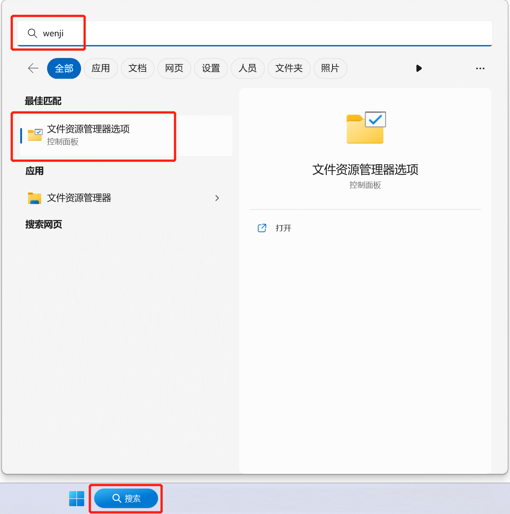
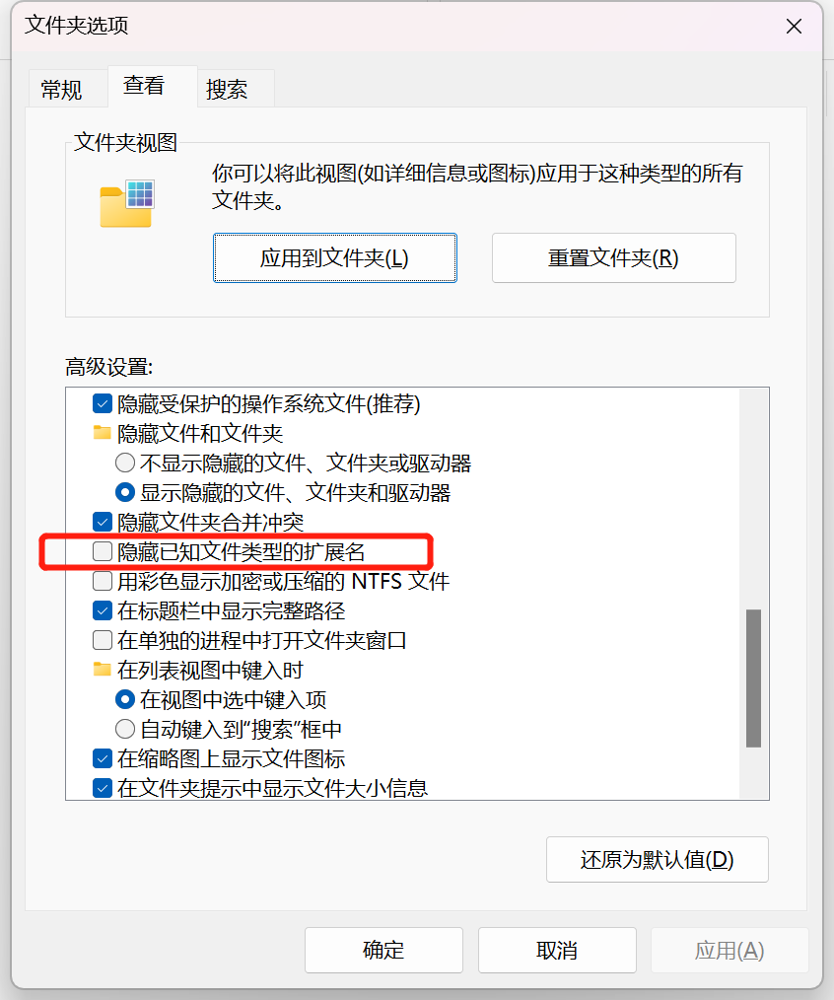
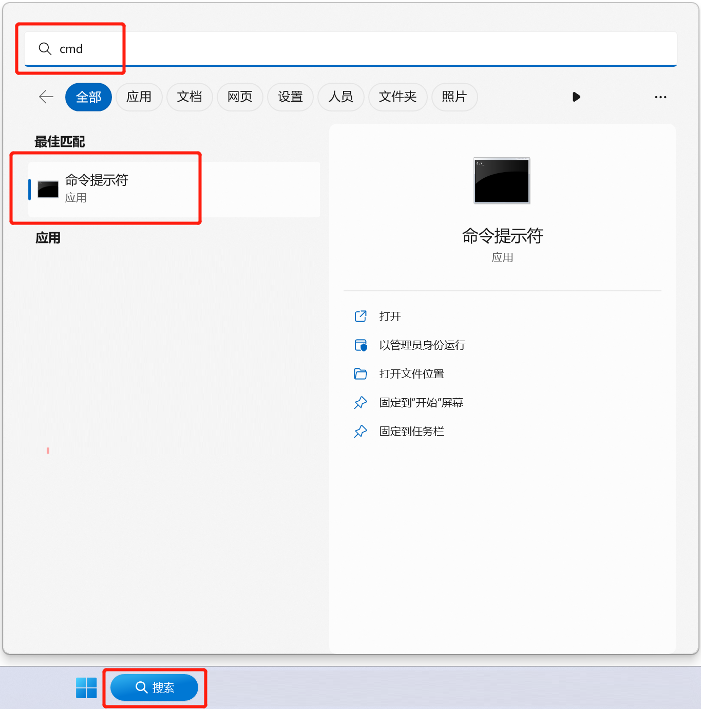
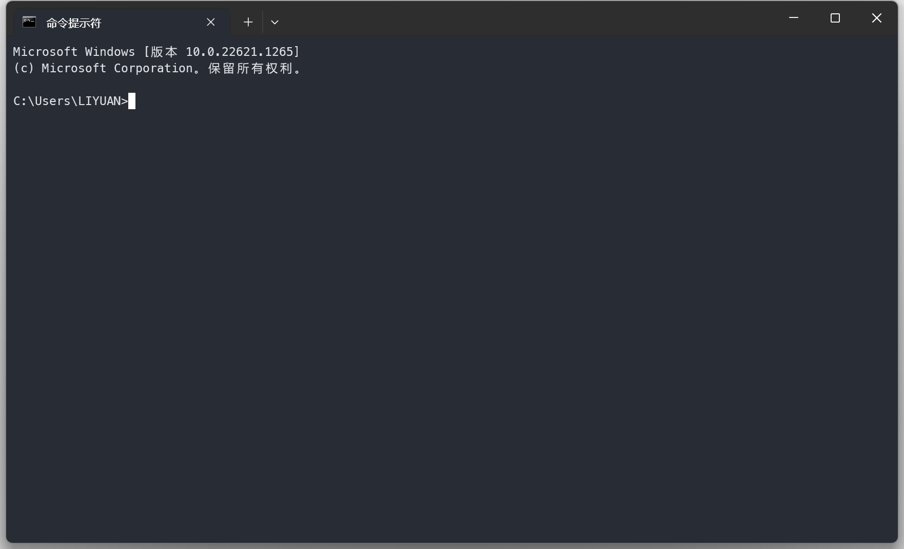
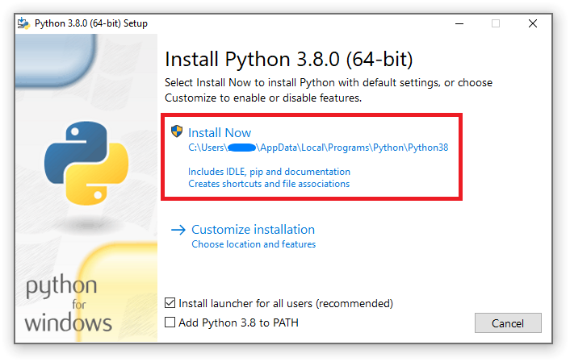
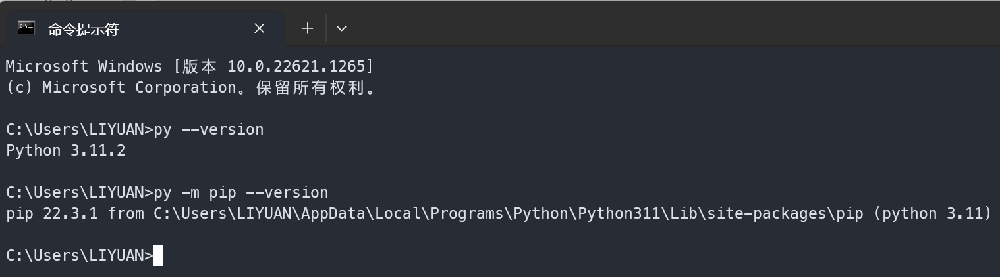
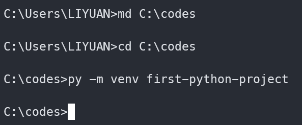
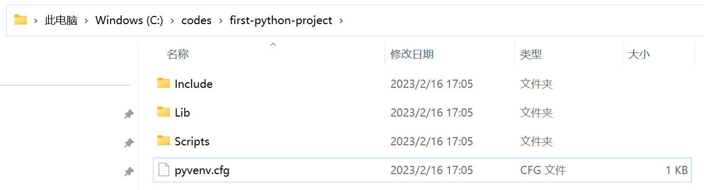
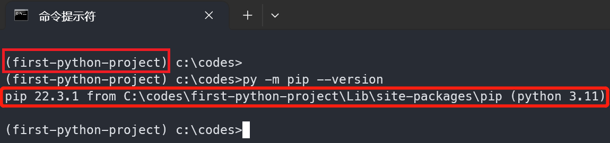
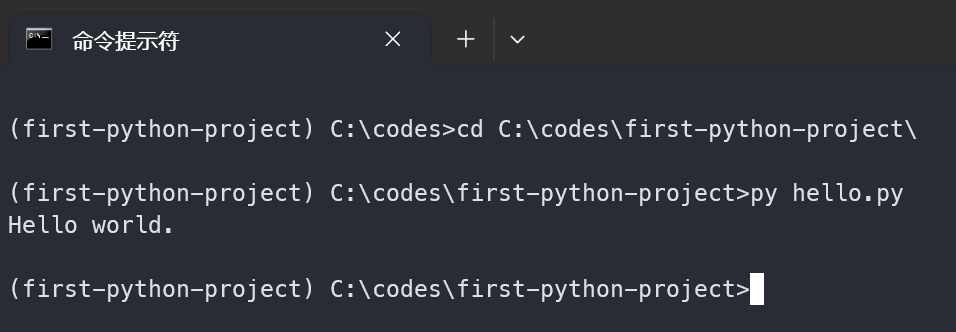

# 面向非计算机专业研究者的 Python 使用指南

本指南面向主要使用 Windows 系统、但需要用 Python 处理数据或运行科研程序的同学，介绍从安装 Python、创建虚拟环境到运行第一个程序的基础步骤。

## 先调整一个使用习惯

建议先关闭 Windows 的“隐藏已知文件类型扩展名”选项，避免把 `report.txt` 误命名为 `report.txt.txt`。



不要勾选隐藏扩展名选项。



Python 源代码文件通常是 `*.py`。双击运行虽然方便，但不便于传入参数、观察报错和重复执行。日常开发更推荐使用“命令提示符”或 Windows Terminal。



点击运行后会出现黑色或深色窗口，在其中输入命令并按回车键执行。



> “命令提示符”“终端”“控制台”在日常交流中经常混用。本文中的操作均可在“命令提示符”或 Windows Terminal 的命令提示符配置中完成。

参考资料：

- [Windows 命令行基础](https://learn.microsoft.com/zh-cn/windows-server/administration/windows-commands/windows-commands)

## 安装 Python

建议从 Python 官网下载当前仍在维护期且操作系统可用的稳定版本。不要选择已经停止维护的旧版本；科研程序如果指定了 Python 版本，应优先遵循程序说明。

- Python 官网下载页：<https://www.python.org/downloads/>

安装时应注意：

- 64 位 Windows 通常选择 `Windows installer (64-bit)`。
- 如果需要支持 ARM 设备，应选择对应架构的安装包。
- 安装界面中建议勾选 `Add python.exe to PATH`；如果没有勾选，后续仍可使用 `py` 启动器。

运行安装程序后，选择默认选项即可。



安装完成后，在“命令提示符”窗口执行：

```cmd
py --version
py -m pip --version
```

如果能看到 Python 和 pip 版本信息，说明安装成功。下图为历史版本安装后的示例输出。



## 创建虚拟环境

虚拟环境可以为每个项目保存独立的 Python 包版本，避免不同课题或程序依赖同一个全局环境而互相影响。

例如创建 `C:\codes\first-python-project`：

```cmd
md C:\codes
cd C:\codes
py -m venv first-python-project
```



创建完成后，项目目录中会出现 Python 运行环境相关的子目录和文件。



在命令提示符中激活虚拟环境：

```cmd
cd C:\codes\first-python-project
Scripts\activate
py -m pip --version
```



命令提示符前的路径前缀变为当前虚拟环境路径时，说明环境已激活。

### 可选：配置 pip 镜像

如果访问 Python 官方包仓库较慢，可以配置镜像源。在命令提示符中执行：

```cmd
py -m pip config --user set global.index-url https://mirrors.aliyun.com/pypi/simple/
```
如需恢复默认源，可执行：

```cmd
py -m pip config --user unset global.index-url
```

## 编写并运行第一个程序

在虚拟环境目录中创建 `hello.py`：

```python
print("Hello world.")
```

保持虚拟环境处于激活状态，执行：

```cmd
cd C:\codes\first-python-project
py hello.py
```

正确运行后会输出：

```text
Hello world.
```



## 安装开发工具

VS Code 适合作为轻量编辑器使用：

1. 从 [Visual Studio Code](https://code.visualstudio.com/) 官网下载并安装。
2. 打开 VS Code 后进入扩展面板。
3. 安装 Microsoft 提供的 `Python` 扩展。
4. 用 VS Code 打开 `C:\codes\first-python-project`。
5. 新建或打开 `hello.py`，按提示选择当前虚拟环境中的 Python 解释器。

如果需要统一代码格式，可以在虚拟环境中安装 Black：

```cmd
py -m pip install -U black
py -m black hello.py
```

## 常见问题

- **`py` 不是内部或外部命令**：重新运行 Python 安装程序，确认 Python Launcher 已安装；或直接使用 Python 安装路径中的解释器。
- **激活脚本无法运行**：检查当前 shell 是否为命令提示符或 Windows Terminal 的 Command Prompt 配置；PowerShell 需要先确认执行策略。
- **包安装很慢**：检查网络，或按前文配置镜像源。
- **不同项目依赖冲突**：为每个项目单独执行 `py -m venv`，不要把所有包都安装到全局环境。

## 参考资料

- [Python 官方文档](https://docs.python.org/zh-cn/3/)
- [Python Packaging User Guide](https://packaging.python.org/zh-cn/latest/tutorials/installing-packages/)
