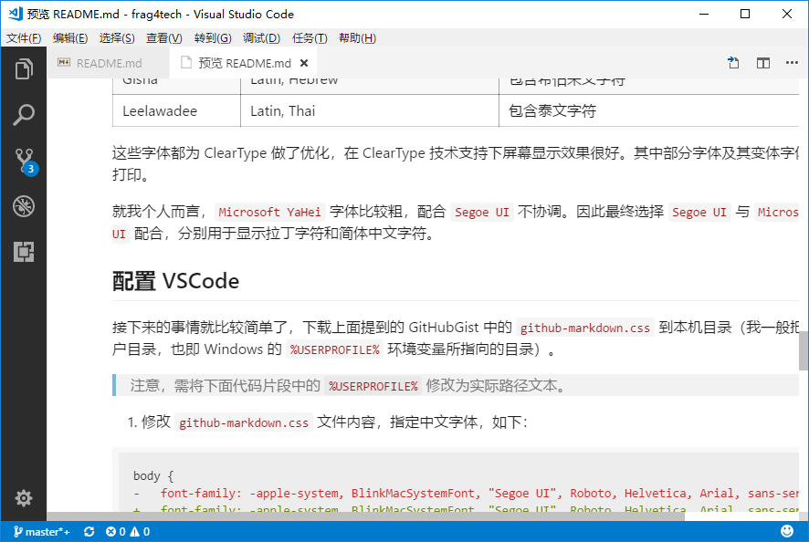
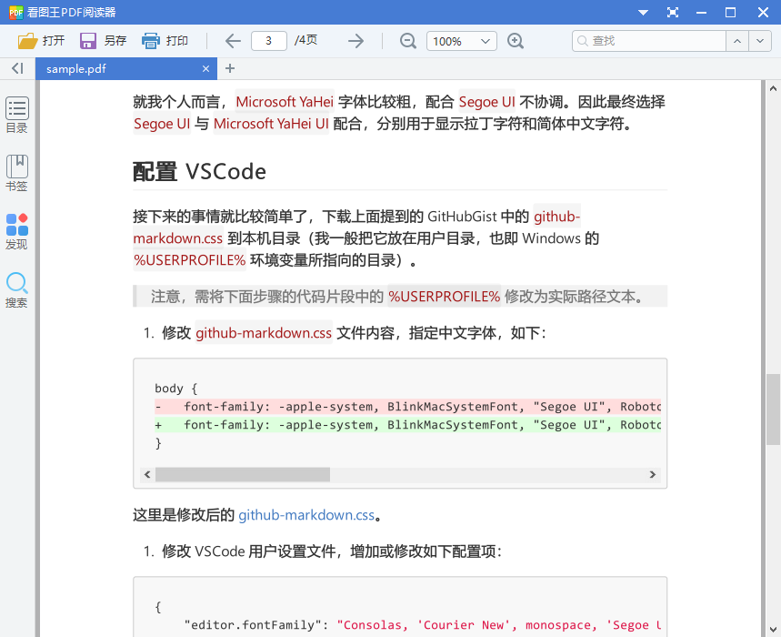

# 在 VSCode 预览中使用 GitHub 的中文 Markdown 样式

## 效果展示

+ 修改后的预览样式



+ [导出 PDF 样例](./sample.pdf)（无固定宽度）



## 背景

最近常将一些心得收获整理成 Markdown 提交到 GitHub 上共享和管理起来。

在 Windows 中使用 VSCode 编辑 Markdown 文件时，会觉得 VSCode 默认的 Markdown 预览样式与 GitHub 显示样式有一些差异，不能直观的看到 Markdown 文件发布到 GitHub 后的显示效果，并且其默认使用的中文字体也不太美观。

## GitHub Markdown 样式

一番搜索后，发现了：

+ [GitHub 官方的 Markdown 文件网页渲染样式](https://github.com/sindresorhus/github-markdown-css)

以及

+ [基于 GitHub 官方样式，为 VSCode 预览优化的样式](https://gist.github.com/BigstickCarpet/5d31c053d0b1d52389eb2723f7550907)

不过这个样式没有指定恰当的中文字体，仍然不够美观。

## 中文字体选择

[微软 Windows 桌面视觉设计指南](https://msdn.microsoft.com/en-us/library/windows/desktop/dn742483(v=vs.85).aspx)

这篇文章中对 `中日韩(CJK)` 等文字字体有一些推荐：

| 字体名             | 包含字符                                      | 描述                                                     |
| ------------------ | --------------------------------------------- | -------------------------------------------------------- |
| Segoe UI           | Latin, Greek, Cyrillic, and Arabic characters |                                                          |
| Microsoft YaHei    | Latin, Chinese (Simplified)                   | 包含简体中文字符，Latin 字符部分是基于 Segoe UI 的定制版 |
| Microsoft JhengHei | Latin, Chinese (Traditional)                  | 包含繁体中文字符，Latin 字符部分是基于 Segoe UI 的定制版 |
| Meiryo             | Latin, Japanese                               | 包含日文字符，Latin 字符部分是基于 Verdana 的定制版      |
| Malgun Gothic      | Latin, Korean                                 | 包含韩文字符，Latin 字符部分是基于 Segoe UI 的定制版     |
| Gisha              | Latin, Hebrew                                 | 包含希伯来文字符                                         |
| Leelawadee         | Latin, Thai                                   | 包含泰文字符                                             |

这些字体都为 ClearType 做了优化，在 ClearType 技术支持下屏幕显示效果很好。其中部分字体及其变体字体也适用于打印。

就我个人而言，`Microsoft YaHei` 字体比较粗，配合 `Segoe UI` 不协调。因此最终选择 `Segoe UI` 与 `Microsoft YaHei UI` 配合，分别用于显示拉丁字符和简体中文字符。

## 配置 VSCode

接下来的事情就比较简单了，下载上面提到的 GitHubGist 中的 `github-markdown.css` 到本机目录（我一般把它放在用户目录，也即 Windows 的 `%USERPROFILE%` 环境变量所指向的目录）。

> 注意，需将下面步骤的代码片段中的 `%USERPROFILE%` 修改为实际路径文本。

1. 修改 `github-markdown.css` 文件内容，指定中文字体，如下：

```diff
body {
-   font-family: -apple-system, BlinkMacSystemFont, "Segoe UI", Roboto, Helvetica, Arial, sans-serif, "Apple Color Emoji", "Segoe UI Emoji", "Segoe UI Symbol";
+   font-family: -apple-system, BlinkMacSystemFont, "Segoe UI", Roboto, Helvetica, Arial, sans-serif, "Apple Color Emoji", "Segoe UI Emoji", "Segoe UI Symbol", "Microsoft YaHei UI";
}
```

这里是修改后的 [github-markdown.css](./github-markdown.css)。

1. 修改 VSCode 用户设置文件，增加或修改如下配置项：

```json
{
    "editor.fontFamily": "Consolas, 'Courier New', monospace, 'Segoe UI', 'Microsoft YaHei UI'",

    "markdown.styles": [
        "file:///%USERPROFILE%/github-markdown.css"
    ],
    "markdown.preview.fontFamily": "-apple-system, BlinkMacSystemFont, 'Segoe WPC', 'Segoe UI', 'HelveticaNeue-Light', 'Ubuntu', 'Droid Sans', sans-serif, 'Microsoft YaHei UI'",
}
```

1. 如果使用了 `Markdown PDF` 插件，也可以做了相应配置，以便从 Markdown 导出 PDF 时也具有同样的样式效果：

```json
{
    "markdown-pdf.styles": [
        "file:///%USERPROFILE%/github-markdown.css"
    ],
    "markdown-pdf.highlightStyle": "github.css",
}
```

## 其它问题

上述 `github-markdown.css` 文件样式设定了页面宽度为 `880px`，好处是无论预览窗口宽度如何，都可以按 GitHub 页面效果布局文字内容，但在 VSCode 中左右分屏显示 Markdown 和预览时，预览会有横向滚动条，不方便查看。

如果不需要严格以 GitHub 样式显示，可以移除相关的样式定义：

```diff
 html {
-   width: 880px;
    padding: 45px;
    margin-top: 25px;
    margin-bottom: 125px;
-   border: 1px solid #ddd;
-   border-radius: 3px;
}
```
