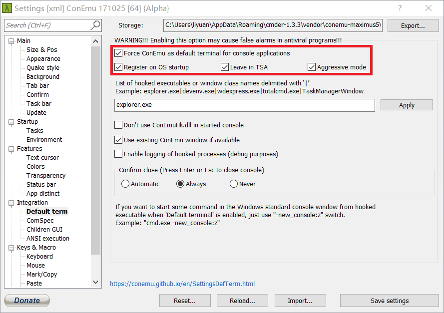

# 为 Windows 控制台应用程序设置默认的 CodePage

## 背景

Windows 系统中的默认终端（Terminal）已经做了许多改进，使得运行在终端的控制台程序（Console Application）如： `cmd.exe`、`bash.exe`、`wsl.exe`、`ubuntu.exe` 等的命令行交互和字符显示相较以往要流畅许多。

一般来说，我们可以通过 Terminal 窗口的系统上下文菜单（窗口左上角菜单） `默认值` 或 `属性` 来分别设置默认的字体或当前程序的字体。

该设置可以选择系统中注册的等宽字体，不能选择非等宽字体，因为终端不支持对非等宽字体文字间距计算，强行使用会有字符显示重叠的缺陷。因此，在中文 Window 系统中，该界面中没有 `微软雅黑` 之类的非等宽中文字体，只有 `点阵字体`，`新宋体`（没有 `宋体` 是因为它非等宽）、`黑体` 等。同时，该设置中也没有 `Courier New`、`Consolas`、`Ubuntu Mono`、`Source Code Pro` 之类的等宽英文字体可选。这是因为在中文 Windows 系统中 Terminal 的默认代码页是 `936 (ANSI/OEM - 简体中文 GBK)`，而上述常用的英文等宽字体中不包含中文字符。

此情况在许多不同语言（如中文、日文、韩文等）的 Windows 系统中都存在。

经常使用控制台程序的技术人员通常不会满足于使用 `点阵字体`、`新宋体`，这里提供中文 Window 系统中调整终端字体的几种方式。

## 处理办法 1

**使用支持中文字符的等宽、*美观的* 字体。**

可惜的是到目前为止没有支持中/英文字符的、正规的、商业品质的适合用于代码显示的字体。广泛使用的是若干爱好者自行拼凑 `微软雅黑` 和 `Consolas` 两种字体而来的组合字体。这些组合字体有时因为细节处理不到位，实际显示时会有瑕疵。

多次尝试后，我觉得这款组合字体品质较好：[Microsoft_YaHei_Mono.7z](./Microsoft_YaHei_Mono.7z)

还可以参考：[https://github.com/shaonianruntu/YaHei-Consolas-Hybrid-1.12](https://github.com/shaonianruntu/YaHei-Consolas-Hybrid-1.12)

下载上面的压缩包，解压缩后，在文件资源管理器中将 `Microsoft YaHei Mono.ttf` 文件拖放到 `C:\Windows\Fonts` 文件夹中，系统即会自动安装该字体，然后就可以在终端属性设置中选择了。

顺便提一句，Windows 10 默认控制台已经不需要修改 `HKEY_LOCAL_MACHINE\SOFTWARE\Microsoft\Windows NT\CurrentVersion\Console\TrueTypeFont` 下的键值了。

## 处理办法 2

**调整中文 Windows 系统中 Terminal 的默认代码页为 `65001 (UTF-8)`，而不是 `936 (ANSI/OEM - 简体中文 GBK)`，然后指定使用 `Consolas` 或其他等宽英文字体。**

任一控制台应用程序启动时，终端会查找注册表 `HKEY_CURRENT_USER\Console\` 下的相关键值，以指定的代码页初始化终端窗口。如果我们指定了 `UTF-8` 而不是 `GBK`，那么即便指定的字体不包含中文字符，但只要能匹配 `UTF-8` 代码页就可以了。此时英文显示会使用指定的 `Consolas` 等宽字体，比较美观；但中文字符会以系统内置的 *fallback* 字体显示，比较难看。如果不在意中文显示难看的话，可以使用这种方式。

例如，可以针对命令提示符（cmd.exe）程序做如下设置：

```plain
Windows Registry Editor Version 5.00

[HKEY_CURRENT_USER\Console\%SystemRoot%_System32_cmd.exe]
"CodePage"=dword:0000fde9
```

其中 DWORD 值 `fde9` 即十进制 `65001`。

> 提示：
> 手动创建上述控制台程序对应的注册表键比较容易出错，该键会在我们对相应控制台程序进行上下文菜单 `属性` 中做自定义设置后自动创建，所以简便起见可以先随意做一次字体修改，然后再到注册表中查找相应键增加或修改 `CodePage` 等键值，最后再到属性界面选择合适的字体。

这里是我常用的终端代码页、字体的设置：[console-codepage-font.reg](./console-codepage-font.reg)

### 注意

上述修改默认代码页的方式不适用于以快捷方式启动的控制台程序，因为快捷方式文件（.lnk）中包含有代码页设置，此设置默认为系统控制面板 `区域` 设置所指定的 `非 Unicode 程序的语言` 对应的代码页，且不能通过快捷方式的右键“属性”修改，它会比注册表项更优先的发挥作用。

例如开始菜单中的程序项、固定到“开始”屏幕的程序项、固定到任务栏的程序项、自己创建的快捷方式等都会在有相应 `.lnk` 中保有自己的代码页设置。只有直接运行的程序，比如通过“运行”命令 `[Win] + [R]` 或直接双击 EXE 执行文件，上述注册表设置才会生效。

这个帖子里有许多关于这方面的讨论，有兴趣的可以参考查看：[https://github.com/Microsoft/WSL/issues/757](https://github.com/Microsoft/WSL/issues/757)

## 处理办法 3

**放弃 Windows 默认终端，使用替代终端程序。**

上面两种方法基于系统默认终端，其中使用组合字体可能有显示瑕疵，修改终端代码页和字体也有快捷方式限制，也许放弃系统默认终端也不失为一种选择。

Windows 终端替代品推荐 [Cmder](http://cmder.net/)。

Cmder 基于强大的 [Conemu](https://conemu.github.io/)，并在其上默认配置了 Monokai 显示样式，并利用了 [Git for windows](http://gitforwindows.org/) 引入了 Git 和 *NIX Bash 命令能力，功能强大且简单方便，默认显示字体就比较美观，设置其他字体也很方便。

如果你喜欢，甚至可以拦截默认终端调用，将 Cmder 作为默认终端使用。



具体配置界面比较明了，就不多作解释了，大家可以自行下载尝试。

## 其他方法

Windows 有一个 `FontLink` 技术，能将多种字体互补使用，主字体不支持的字符会在系统级别以关联字体的字符显示，是一个比较有意思的技术，有时间再整理。

可以参考：

[https://www.cnblogs.com/RhinoC/p/4470338.html](https://www.cnblogs.com/RhinoC/p/4470338.html)

[http://blog.sina.com.cn/s/blog_5d86a24d01011x3i.html](http://blog.sina.com.cn/s/blog_5d86a24d01011x3i.html)

## 杂项

### 注意

有些文章指出通过修改 `HKEY_LOCAL_MACHINE\SYSTEM\CurrentControlSet\Control\Nls\CodePage\OEMCP` 为 `65001` 来处理，这样做比较危险，因为系统初始化时有可能因为这个改动而无法启动。

### 猜测执行过程

默认 Windows Terminal 在初始化时会按以下步骤执行：

1. 首先尝试读取注册表中与 Console 程序相对应的代码页设置。

    比如运行系统默认命令提示符程序 `%SystemRoot%\System32\cmd.exe` 时，将读取注册表 `HKEY_CURRENT_USER\Console\%SystemRoot%_System32_cmd.exe\CodePage` 的值（DWORD）。

    该键值将在第一次设置 `cmd.exe` 程序的窗口上下文菜单 `属性` 时创建。

1. 如果第 1 步未获取到（比如从未设置过 Console 程序的窗口 `属性` 菜单），则获取 Windows Terminal 的默认值。该默认值存放在 `HKEY_CURRENT_USER\Console\CodePage` 中。

1. 尝试加载 Console 程序的字体配置。

    以 `%SYSTEMROOT%\System32\cmd.exe` 为例，仍然是先找 `HKEY_CURRENT_USER\Console\%SystemRoot%_System32_cmd.exe\FaceName` 值（字符串）。找不到的话，就加载 Terminal 默认值 `HKEY_CURRENT_USER\Console\FaceName`。

1. 检测 `FaceName` 指定的字体是否支持 `CodePage` 指定的代码页。

1. 如果第 4 步字体不支持，则回退 `CodePage` 为系统控制面板 `区域` 设置所指定的 `非 Unicode 程序的语言` 对应的代码页。比如简体中文 Windows 中相应 `CodePage` 为 `936`。

1. 根据第 5 步的代码页查找支持的字体名称。比如 `CodePage 936` 对应于 `HKEY_LOCAL_MACHINE\SOFTWARE\Microsoft\Windows NT\CurrentVersion\Console\TrueTypeFont\936` 值，默认是 `新宋体`。

1. 根据前面确认的 CodePage 和字体初始化 Terminal。
