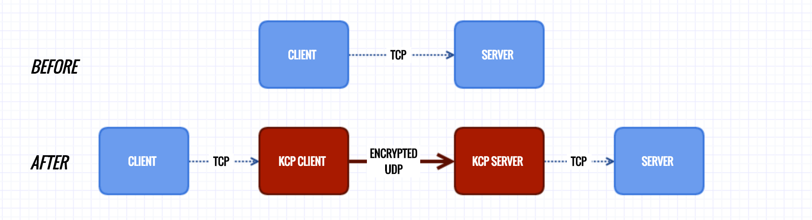

# 混淆和加速程序 kcptun 安装

[kcptun 主页](ttps://github.com/xtaci/kcptun)

工作示意图：



安装部署还可以参考：https://www.cmsky.com/kcptun/

## kcptun 服务端

在 https://github.com/xtaci/kcptun/releases 下载 Ubuntu x64 对应的 kcptun，如 `kcptun-linux-amd64-20180305.tar.gz`。

```shell
cd ~
curl -OL https://github.com/xtaci/kcptun/releases/download/v20180305/kcptun-linux-amd64-20180305.tar.gz
```

解压缩

```shell
tar -zxf kcptun-linux-amd64-20180305.tar.gz
```

解压后有 `server_linux_amd64` 和 `client_linux_amd64` 两个文件，其中 `server_linux_amd64` 是 Linux 服务端需要的。为方便使用，我们将它移动并改名。

```shell
mv server_linux_amd64 /usr/local/bin/kcptun_server
```

创建启动参数配置文件。

```shell
mkdir /etc/kcptun
touch /etc/kcptun/config.json
```

编辑内容参考如下，注意 `target` 值是本机 shadowsocks 服务开放侦听的地址及端口，`key` 是连接 kcptun 的密码。其他参数请参考 `kcptun --help`。

```json
{
    "listen": ":29900",
    "target": "127.0.0.1:8388",
    "key": "test",
    "crypt": "salsa20",
    "mode": "fast2",
    "mtu": 1350,
    "sndwnd": 1024,
    "rcvwnd": 1024,
    "datashard": 70,
    "parityshard": 30,
    "dscp": 46,
    "nocomp": false
}
```

创建启动、停止脚本：

```shell
touch /usr/local/bin/kcptun_start.sh
touch /usr/local/bin/kcptun_stop.sh
```

脚本内容如下：

```shell
#!/bin/bash
/usr/local/bin/kcptun_server -c /etc/kcptun/config.json > /etc/kcptun/kcptun.log 2>&1 &
echo "kcptun started."
```

```shell
#!/bin/bash
echo "stopping kcptun..."
PID=`ps -ef | grep kcptun_server | grep -v grep | awk '{print $2}'`
if [ "" !=  "$PID" ]; then
  echo "killing $PID"
  kill -9 $PID
fi
echo "kcptun stopped."
```

添加到开机自启动：

```shell
chmod +x /etc/rc.local
echo "sh /usr/local/bin/kcptun_start.sh" >> /etc/rc.local
```

## kcptun 客户端
