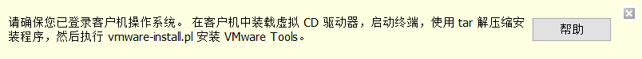

# 在 Windows 宿主机与 Ubuntu Server 虚拟机之间共享文件夹

在 Windows 宿主操作系统、Ubuntu Server 虚拟机（WMware Workstation）场景下，本文描述了两种在 Windows 宿主和 Ubuntu Server 虚拟机之间共享文件夹的方法。

## 使用 VMware Tools 共享文件夹

参考文章：[如何在Linux命令行模式安装VMware Tools](https://jingyan.baidu.com/article/8ebacdf070c40c49f75cd558.html)

### 安装 VMware Tools

* 启动 Ubuntu 虚拟机，进入 Ubuntu 系统

* 执行 VMware Workstation 主界面的菜单项： 虚拟机 -> 安装 VMware Tools，稍等一会儿界面下方会有提示消息。



* 根据提示消息，运行下述命令执行安装

```shell
# 检查是否有光盘
sudo ls /dev/cdrom

# 检查光盘挂载路径，如果没有就创建
sudo ls /mnt/cdrom
sudo mkdir /mnt/cdrom

# 挂载光盘
sudo mount -t iso9660 /dev/cdrom /mnt/cdrom

# 检查光盘内容
sudo ls /mnt/cdrom

# 复制安装包
cp /mnt/cdrom/VMwareTools-*.tar.gz /tmp/

# 解压缩
tar -xzf /tmp/VMwareTools-*.tar.gz

# 执行安装程序
/tmp/vmware-tools-distrib/vmware-install.pl

# 安装过程中可能会提示检测到 open-vm-tools，提示卸载。
# sudo apt remove open-vm-tools
# 安装最后一步，会提示运行一次配置程序 /usr/bin/vmware-config-tools.pl

# 安装好后重新启动
sudo shutdown -r now

# 如需卸载，可以运行
/usr/bin/vmware-uninstall-tools.pl
```

### VMware Tools 共享文件夹

* 关闭虚拟机

* 执行 VMware Workstation 主界面菜单项：虚拟机 -> 管理 -> 共享，按界面提示完成共享文件夹设置。

* 启动 Ubuntu 虚拟机，在 Ubuntu 中访问共享的文件夹

```shell
# 共享的文件夹会挂载在 /mnt/hgfs/ 文件夹下
sudo ls /mnt/hgfs
```

## 使用 open-vm-tools

open-vm-tools 是 VMware 推出的开源 VMware Tools 实现，VMware 推荐在支持的 Linux 发行版中使用 open-vm-tools 而不是 VMware Tools。在具备 open-vm-tools 的 Linux 中安装 VMware Tools 时，会得到提示：

> open-vm-tools are available from the OS vendor and VMware recommends using
open-vm-tools. See http://kb.vmware.com/kb/2073803 for more information.

### 安装 open-vm-tools

open-vm-tools 已随下列 Linux 发行版发布：

* Red Hat Enterprise Linux 7.0 and later releases
* SUSE Linux Enterprise 12 and later releases
* Ubuntu 14.04 and later releases
* CentOS 7 and later releases
* Debian 7.x and later releases
* Oracle Linux 7 and later
* Fedora 19 and later releases
* openSUSE 11.x and later releases

使用上述操作系统默认会带有 open-vm-tools。

手动安装参考如下命令：

```shell
# 查看软件包列表
sudo apt-get update
sudo apt-cache search open-vm

# 安装 CLI 版 open-vm-tools
sudo apt-get install open-vm-tools

# 如果是桌面版 Linux，希望提供 用桌面拖放操作在宿主机和虚拟机间传输文件 的功能，则需要安装
sudo apt-get install open-vm-tools-desktop
```

### open-vm-tools 共享文件夹

参考文章：[Enabling shared folders with open-vm-tools](https://askubuntu.com/questions/580319/enabling-shared-folders-with-open-vm-tools)

```shell
# 检测挂载路径，如果没有就创建
sudo ls /mnt/hgfs
sudo mkdir /mnt/hgfs

# 挂载宿主机共享目录
sudo mount -t fuse.vmhgfs-fuse .host:/ /mnt/hgfs -o allow_other

# 为方便起见，可以做个目录链接
sudo ln -s /mnt/hgfs ~/host_share
```

如果要每次重启自动挂载，编辑 /etc/fstab 文件，加入下行描述。

```shell
sudo tee -a /etc/fstab <<-'EOF'
.host:/ /mnt/hgfs fuse.vmhgfs-fuse allow_other 0 0
EOF
```
